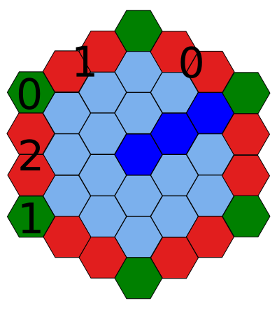
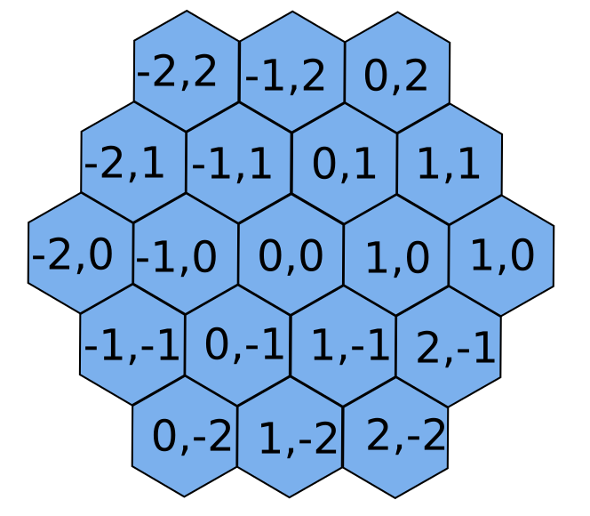

# hexagonal-grid Documentation

The purpose of this project is to be able to render a hexagonal grid in a
general way such that it can be used in other projects. For now these docs will
describe how the world is broken up into chunks and how those chunks are stored
in memory.

## Chunks

To be able to render the world efficiently it is split into chunks, the size of
these chunks can be given as a parameter. A chunk is hexagonal (blue) as seen in
the image below. The chunk is surrounded by edges (red) of hexagons and vertices
(green) of just a single hexagon each. These are there to glue chunks together
such that thay can be placed regularly. New chunks would then start at the other
side of each of the edges. The size of the chunk is defined as the number of
layers, in this example it would be 3 (The edge does not count as part of the
chunk size).

Each chunk has 3 associated edges and two associated vertices which are denoted
by their id in the image. They are also named right_edge(0), left_edge(1),
vertical_edge(2), top_vertex(0) and bottom_vertex(1). The rest of the edges and
vertices in the image are associated with neighbohring chunks.

In memory all the hexagonal tiles of a chunk are saved in one long list. The
tiles are ordered from the inner layer and out. Within a layer the first tile is
shaded a darker blue and the resut of the tiles are saved in counter clockwise
ordering. In edges the tiles are stored in counter clockwise order relative to
their associated chunk.

To be able to distinguish chunks in the program, each one is identified with a
unique id of two signed integers (x and y) and edges and vertices enherit their
id from their associated chunks. Some arbitrary chunk is chosen as the origin
(0, 0) and wheen the y-component increases by one we move up to the next row and
to the right since there are no chunk directly above. When the x-component
increases the chunk to the right in the same row is chosen. For decreases we
move the opposite direction. An example can be seen in the image below.

